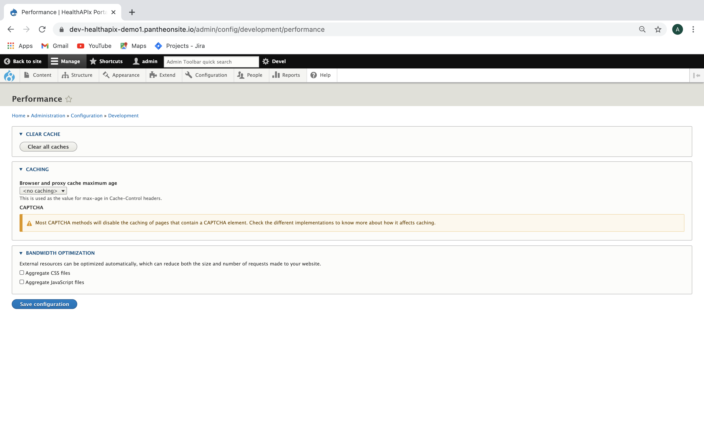

# HealthAPIx Developer Portal Content Publishing Guide for Admin

[Step 1: Import Slider content](#Step-1:-Import-Slider-content)

[Step 2: Add Get Started page](#Step-2:-Add-Get-Started-page)

[Step 3: Content Configuration](#Step-3:-Content-Configuration)

## Step 1: Import Slider content

### A: Import Home page slider

* Navigate to the slider import page `http://(ip address of the portal)/admin/content/dexp_layerslider/import`

* Click on 'Choose file' under 'Upload export file' as shown in screenshot below


* Navigate to the folder that contains the `slider.txt`. A sample 'slider.txt' file is available in git repository under portal directory:

`$repository-base-dir/portal/slider.txt`

* Wait for file to upload and then Click on 'Import'

* This imports the content as Home page sliders

### B: Enable the Home page blocks

* Navigate to the Block layout page using the link `http://(ip address of the portal)/admin/structure/block`

* Note the highlighted 'Enable' links against some blocks towards right side as shown in the screenshot below


* Click on enable for each of the highlighted blocks to enable the block

* This enables the Content blocks on the home page.

### C: Enable footer block

* Navigate to the Block layout page using the link `http://(ip address of the portal)/admin/structure/block`

* Note the highlighted 'Enable' links against some blocks towards right side as shown in the screenshot below


* Click on enable for the highlighted blocks to enable the block

* This enables the Footer block on all the pages.

### D: Clear the cache

* Navigate to `http://(ip address of the portal)/admin/config/development/performance`

* Click on 'Clear all Caches' to clear the cache.

## Step 2: Add Get Started page

* Navigate to `http://(ip address of the portal)/node/add/overview_page`

* Add the title as 'Get Started'

* Under the Section Block, please add the title of the section which is name of the tab in the Get Started page

* Add the Description in the Description field, to add the description of the tab.


* User can add the content as shown in the screenshot below

  
* Under the URL alias section in the right block, please add the url as `/getting-started`

* Click on Save to save the changes for the Get Started page.

* The Get started page looks as below screenshot


## Step 3: Content Configuration

### A: Basic site settings

* Navigate to the below URL to update basic settings of the site.
`https://(ip address of the portal)/admin/config/system/site-information`

* Modify values of the following:

1. Site name
1. Slogan
1. Email address

* Click on Save Configuration to save the details.


### B: Taxonomy, Block and Menu Import

* Navigate to
`https://(ip address of the portal)/admin/structure/structure-sync/taxonomies`

* Click on Import Taxonomies (Safely) to import the taxonomies into the site.

* Click on the Custom blocks tab

* Under the Import block, Click in Import Custom Blocks (safely)

* It will import all the custom blocks in the site.

* Click on the Menu links tab in the same page

* Under the Import block, click on import menu links safely to import the menus.


### C: Create API docs

* Navigate to Content -> Add Content -> API Doc

* Add details as shown below in the screenshot.


* The Interoperability API tag field is an taxonomy term autocomplete field which is used to tag the content for the hierarchy in the API doc/swagger. The content which is tagged will be displayed under that respective  tag in the left side hierarchy block in the api doc page.

* Add all the details and click on 'Save' for the content to be created

* A success message is displayed. Click on the link in the success message OR Click on the API Doc of the resource that you created from the Item list. This takes you to a web page. Note and copy the web page path as highlighted in image below. This will be required in next Step to configure API Documentation Menu link.


* This action also adds the link in the hierarchy block.


### D: Configure API Documentation Menu Link

* Navigate to Structure -> Menus -> Main menu -> API Documentation -> Click on Edit

* As shown in the below screenshot, use the web page path of the First API doc created in the 'Creat API Doc' step before and fill in the "Link" field in the "Edit Menu Link" form.


* Click Save to save the changes.

* Navigate to the API Documentation page to verify rendering of the API Documentation Menu

### E: Understand API Documentation Menu Link (aka Interopereability API Block)

API Documentation Menu displays the Interoperability Apis and its hierarchy. Clicking on the items(Terms) ex : Patient Access API will take the user to a page which displays the description of the Patient Access api. Below screenshot summarizes API Documentation and Interoperability Hierarchy.


* The Hierarchy structure of Interoperability API can be found under Structure -> Taxonomy -> Interoperability API's -> List Terms

* Click on List Terms to see the hierarchy

* Below is a screenshot of the "Patient Access APIs" edit page. Note the Term name and API Content Link are highlighted. This will be required in next step. Continue with next step to create Patient Access API help page.


* API Content Link is also called as Interoperability API Help page. It needs to be created as follows and the link to the page needs to be updated in the API Content Link higlighted section.

### F: Create Patient Access API help page

* Click on Content -> Add Content -> Interoperability help page

* Add Content as follows

```content
Title-> Patient Access API
Body-> Text content to be displayed in the help page on right side when someone clicks on "Patient Access APIs" in the hierarchy
Interoperability API Tag-> Patient Access API's (start typing and options will appear)
```


* Click on Save

* A success message is displayed. Click on the Link in the Success message Or Click on the "Patient Access API" in the Item list. This takes you to a web page. Note and copy the web page path as highlighted in image below.


* Goto the Hierarchy structure of Interoperability API, Structure -> Taxonomy -> Interoperability API's -> List Terms

* Click on List Terms to see the hierarchy

* Click 'Edit' against "Patient Access APIs". Note the Term and API Content Link are highlighted as in below screenshot


* The copied path from the Patient Access API Help page created previously needs to be added as shown in the screenshot above under API Content Link within the provided text box

* Click on save to save the changes.

```content
Similarly, a help page can be created for all the terms listed under Interoperabililty APIs.
To summarize, create Interoperability help page Content and tag with correct Interoperability API Tag.
Note the web page path by visiting the content created.
Finally update the Listed term API Content link and copy the web page path in the content Link.
```

### G: Create FHIR Conformance Page description

* This configuration page provides the option to add a description on the FHIR conformance page

* Login as Admin into the Developer Portal

* Navigate to the below   and then provide the text required for description
`https://(ip address of the portal)/admin/config/system/fhirconformanceverbiage`


### H: Configure FHIR Conformance Metadata

* Login as Admin into the Developer Portal

* Check and Add administrator permission to admin user by going to following
`https://(ip address of the portal)/admin/people`

* Search for 'admin' by entering 'admin' and clicking on 'filter'

* From the listed search results, click 'edit' under Operations column against USERNAME 'admin'

* In the next page, scroll down to 'Roles' section and select checkbox against 'administrator'

* Click 'Save' to save these changes

* Navigate to the below URL to update the FHIR conformance metedat urls
`https://(ip address of the portal)/admin/config/conformance_api`

* Add the metadata urls for the R4, STU3 and the DSTU2 server

* Click on Save Configuration to save the configuration.

* Once the form is saved, please clear the caches by going to the below   and clicking in clear all caches
`https://(ip address of the portal)/admin/config/development/performance`

* Navigate to the below   to check if the conformance metadata is working
`https://(ip address of the portal)/conformance-report`



### I: Create FHIR Samples

* Login into Developer Portal as Admin user

* From the Drupal Menu Goto Content -> Add Content -> FHIR Sample

* This takes you to "Create FHIR Sample" web page as shown below


* Create a sample by entering values

* Title -> AllergyIntolerance

* payload id -> 201879 (Any random number)

* payload version -> Select FHIR version depending on what version this sample belongs to. Select R4 this time.

* payload -> Enable 'source' mode by clicking on 'source' button and add following formatted text. Include everything including and in between 'pre' tags. NOTE - The content or the text needs to be added in the 'source' mode as it has some html tag in it.

```json
<pre>
{
    "resourceType": "AllergyIntolerance",
    "meta": {
        "versionId": "1",
        "lastUpdated": "2019-09-28T10:06:03.599+00:00"
    },
    "recordedDate": "2016-09-05T20:14:28-04:00",
    "patient": {
        "reference": "Patient/201240"
    },
    "substance": {
        "coding": [
            {
                "system": "http://snomed.info/sct",
                "code": "425525006",
                "display": "Allergy to dairy product"
            }
        ]
    },
    "status": "active",
    "criticality": "CRITH",
    "type": "allergy",
    "category": "food"
}</pre>
```

* Save the Changes

* Saving takes you to a new Web page. An example is shown below. Notice the highlighted portion in the browser address bar. Note this url path. Leave the Developer portal server address and just note the web page suffix as highlighted.


* Create a new Menu link Structure -> Menus -> Main Menu -> Add Links as shown below


* Click on Save

* This takes you to FHIR Samples home page which will show only 1 entry which is just created

* Similarly, FHIR Samples can be added for other FHIR Versions

* Once a sample is added, subsequently any other API Team member can also add FHIR Samples as explained in Content-Configuration-APITeamUser-README.md

### J: Create an item in the API Documentation left navigation menu

* This is a general step to create a new item which does not exist in current listed items in the API Documentation left navigation menu. You can skip this step if you are not sure the new item you want to create in the hierarchical left navigation menu.

* A vocabulary called Interoperability Api is created to maintain the hierarchy in the left navigation menu.

* Login as administrator and navigate to the taxonomy page -> Admin >> Structure >> Taxonomy >> All types

* The page will look as in the below screenshot


* Click on List terms to see all the terms that are listed in that vocabulary and also its hierarchy

* The terms are listed according to the hierarchy in this page

* One can manually drag and change the hierarchy as per the requirements and click on Save to save the hierarchy.

* Click on the Add Term as in the above screenshot to add a new term

* The name field is the name of the term

* Add a description for the term

* The API content link field is the link for the interoperability api help page link which will display the description of the API

* Click on Save to add a new term

* Go back to the list terms page and then adjust the hierarchy of the term as per the requirement

* NOTE: Only hierarchy of two levels are supported as of now

* Terms can be created and arranged from the second level which is Patient Access API

* All the content that is tagged with a term will be displayed under that term in the Interoperability API hierarchy block


