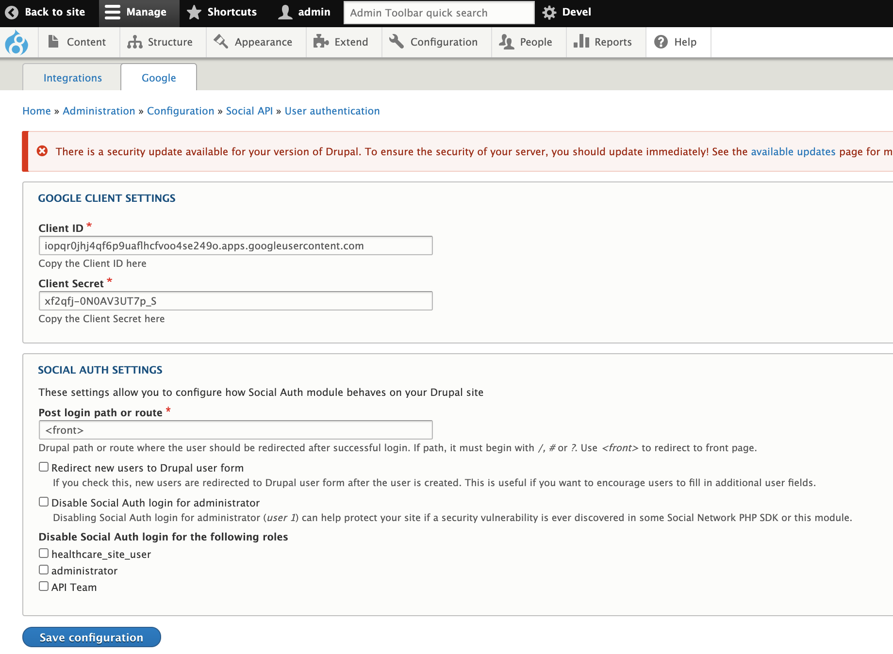
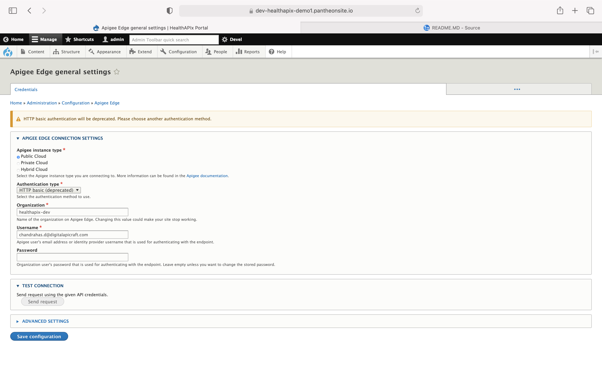
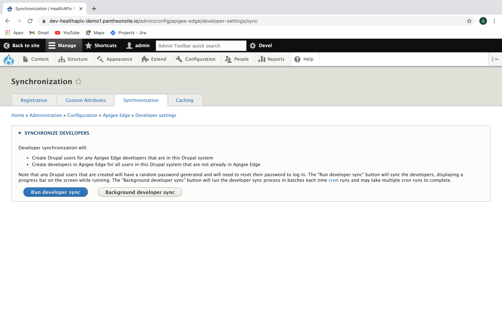
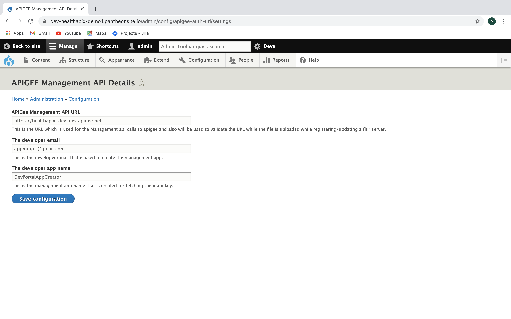
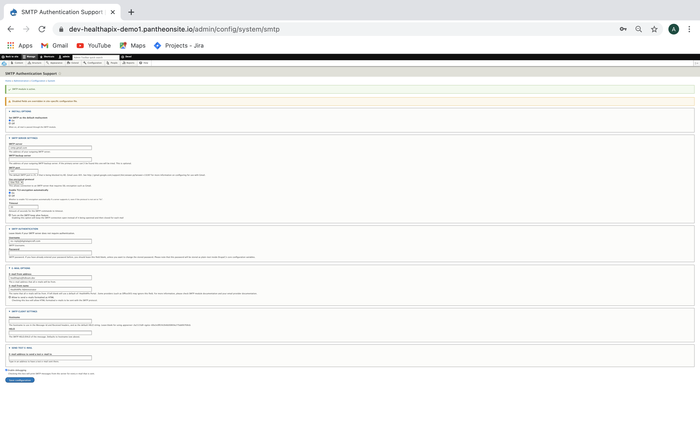
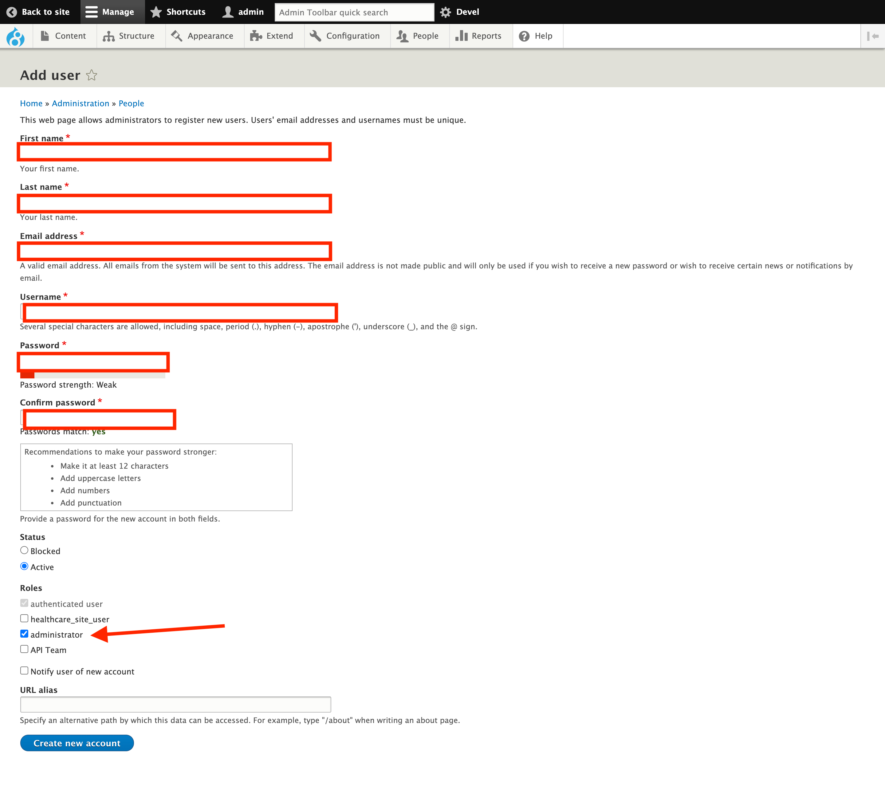

# HealthAPIx Portal Installation Guide

[Step 1: Prerequisites](#Step-1:-Prerequisites)  
[Step 2: Portal Installation](#Step-2:-Portal-Installation)  
[Step 3: Portal Configuration](#Step-3:-Portal-Configuration)  
[Step 4: Create Drupal Content Admin and the API Team Member users](#Step-4:-Create-Drupal-Content-Admin-and-the-API-Team-Member-users)  
[Step 5: Backup and Restore](#Step-5:-Backup-and-Restore)  

## Step 1: Prerequisites

### A) GCP Configuration Details

1. GCP Compute Engine VM instance built with Centos 7.9 image
(The installation script is tested on a CentOS 7.9)

1. OAuth2.0 Web Client Id and Client Secret configured in the GCP Project Credentials page. This is required to connect to Google Sign-in experience (SIGN IN WITH GOOGLE). In your GCP Project, register an OAuth 2.0 Client for web application:

Reference: <https://developers.google.com/identity/protocols/oauth2/web-server>

### B) Apigee Details

HealthAPIx portal connects to an Apigee environment. The Apigee environment details listed below are required for connecting the portal to Apigee:

1. Apigee org = `<apigee-org>` 
1. Apigee env = `<apigee-env>`
1. Apigee admin credentials = `<apigee-username>`
1. DevPortalAppCreator app ClientId = `<app-client-id>`

### C) SMTP Configuration Details

SMTP configuration is required to send email to the API product owners requesting them to approve app's access request to the FHIR API. SMTP configuration details listed below is required:

1. SMTP server = `<smtp-hostname>`
1. SMTP Port   = `<smtp-port>`
1. SMTP username = `<smtp-username>`
1. SMTP password = `<smtp-password>`

### D) Custom User Details

User details including email Id will be required for creating user described in Step 4 of this guide

1. `Drupal Content Admin` is required for content publishing.
1. `API Team` User is required for configuring API Servers.

## Step 2: Portal Installation

Connect to your linux workstation using `ssh`

Check whether the VM is running Centos 7.9 image

```bash
cat /etc/centos-release
```

Check whether Git is installed. If not, install Git

```bash
# Install Git if needed
git --version
sudo yum install git
```

Clone this git repo to your local machine. You may need manually generated credentials. You may generate and store your Git credentials using Google Cloud Source Repositories.

```bash
git clone https://source.developers.google.com/p/hpdi-artifacts/r/healthapix

# Change to sudo user
sudo -i

# Change current directory to devportal directory
cd <git-repo-home>/portal/scripts/devportal/

# Run install script
./install.sh
```

## Step 3: Portal Configuration

Once the portal is installed, then you need to configure the portal. You need a domain name for the SSL certificate. You can generate a self signed certificate initially and then repalce it later on with a CA signed certificate.

### A) Create SSL cert

#### Generate a self signed certificate using openssl

```bash
# Install OpenSSL on server if its not already installed.
yum install openssl openssl-devel
```

```bash
# Create a directory to store keys and certificats.
# Note : Replace the <domain-name> in the commands below:

cd
mkdir -p sslcerts
cd sslcerts

openssl req -new -newkey rsa:4096 -x509 -sha256 -days 365 -nodes -out <domain-name>.crt -keyout <domain-name>.key

openssl rsa -in <domain-name>.key -out <domain-name>-key.pem

openssl x509 -in <domain-name>.crt -out <domain-name>.pem -outform PEM

mkdir -p /etc/ssl/<domain-name>

cp *.pem /etc/ssl/<domain-name>/
```

#### Generate a key and certificate signing request for CA - Optional

This step can be skipped in order to complete this installation by using the self signed certificate created in previous step. A CA signed certificate is required for the TLS but not immediatedly.

```bash
# Run following command to generate a private Key
# Note : Replace the <domain-name> in the command below:
openssl genrsa -out ~/sslcerts/<domain-name>.key 2048

# Run following command to create a CSR with the RSA private key
openssl req -new -sha256 -key ~/sslcerts/<domain-name>.key -out ~/sslcerts/<domain-name>.csr
```

* When prompted, enter the necessary information for creating a CSR:

>* Country Name (2 letter code) [XX]:
>* State or Province Name (full name) []:
>* Locality Name (eg, city) [Default City]:
>* Organization Name (eg, company) [Default Company Ltd]:
>* Organizational Unit Name (eg, section) []:
>* Common Name (eg, your name or your server's hostname) []:
>* Email Address []:

* Run the following command to verify your CSR:

```bash
openssl req -noout -text -in ~/sslcerts/<domain-name>.csr
```

* After you have verified your CSR, you can submit it to a CA to get a CA signed an certificate.

### B) Configuring SSL certs and restart Nginx

Store the ssl certs in your server ( make sure the path is accessible to nginx)

* Navigate to nginx directory and open your nginx configuration file

```bash
cd /etc/nginx

vi nginx.conf
```

* goto port 443 block in nginx.conf and add or edit below lines
Note : Replace the `<domain-name>` in the configuration below and adjust ssl ciphers as per you security policies:

```nginx
server {
    listen 443 ssl;
    server_name <domain-name>;
    ssl_protocols TLSv1.3 TLSv1.2;
    ssl_certificate /etc/ssl/<domain-name>/<domain-name>.pem;
    ssl_certificate_key /etc/ssl/<domian-name>/<domain-name>-key.pem;
    if ($scheme = http) { return 301 https://$server_name$request_uri; }
    ssl_ciphers ECDHE-ECDSA-AES128-GCM-SHA256:ECDHE-RSA-AES128-GCM-SHA256:ECDHE-ECDSA-AES256-GCM-SHA384:ECDHE-RSA-AES256-GCM-SHA384:ECDHE-ECDSA-CHACHA20-POLY1305:ECDHE-RSA-CHACHA20-POLY1305:DHE-RSA-AES128-GCM-SHA256:DHE-RSA-AES256-GCM-SHA384;
    ssl_prefer_server_ciphers on;
    client_max_body_size 100M;
}
```

* Check nginx configuration syntax

```bash
nginx -t
```

* If it is OK, then restart your nginx servers

```bash
systemctl restart nginx
```

### C) Reset the Portal admin password

* Enter the below Url in the browser to login into the portal

`http://(ip address of the VM)/user/login`

* Login as Admin with below mentioned default credentials:

`username - admin`
`password - gHC321#@!`

* Once logged in enter the below Url in the browser to go to Reset password screen

`http://(ip address of the portal)/user/1/edit`

* Follow the Screen guideline to reset the password

* Log off and login again with new credentials

### D) Configure Sign In With Google

Social Auth configuration is required to connect to Google Sign-in experience (SIGN IN WITH GOOGLE). In your GCP Project, register an OAuth 2.0 Client for web application:

Reference: <https://developers.google.com/identity/protocols/oauth2/web-server>

* This is done by creating a OAuth 2.0 Client IDs under APIs and credentials section in GCP Project. This also requires configuring Consent screen with the domain details of Developer portal domain.

* To do this, Login to your GCP Console and Navigate to APIs & Services page and Click on OAuth Consent Screen option from menu.

* Register an App Or if an App is already registered then Click on 'Edit App' next to App name

* In the next screen, scroll down to 'Authorized Domains' and add a domain by clicking in '+ Add Domain' button. Here, add the domain only in the text box. For example - xip.io

* Save and Continue to save the changes

* Now configure OAuth web client in 'Credentials' page. Click on 'Credentials' under APIs & Services

* Either create a new Credentials by clicking on '+ Create Credentials' from top menu OR if the app is already created then Click on 'pencil' icon to edit the intended Web client under 'OAuth 2.0 Client IDs'

* In the next Screen, Edit 'Authorized JavaScript origins' and 'Authorized redirect URIs' as mentioned below

* For Authorized JavaScript origins, enter your domain e.g. <http://localhost>, <http://www.example.com>

* For Authorized redirect URIs, enter the full URL to your Drupal portal + `/user/login/google/callback`. For example, if your domain is: `www.example.com`, then enter <http://www.example.com/user/login/google/callback>  as a value of the Authrorized redirect URI.

* Click on 'Save' to save the changes

Note down the Client ID and Client Secret on top right corner once changes are saved and configure portal as mentioned below.

1. Login to Developer Portal as Admin user.

1. Navigate to Configurations -> Social API settings -> User authentication -> Google

1. Enter Client Id and Client Secret as shown in screenshot below



1. Click on Save configuration to save the changes

### E) Apigee Edge Configuration

HealthAPIx portal can connect to only one Apigee environment. Typically the portal in dev/preview environment connects to Apigee dev environment. HealthAPIx portal in produciton environment connects to Apigee prod environment.

* Login as admin into the Developer portal

* Navigate to the below   to configure the apigee edge settings in the portal
`https://(ip address of the portal)/admin/config/apigee-edge/settings`

* Provide the following details if the authentication type is selected as HTTP
  1. Apigee org name = `<apigee-org>`
  1. Apigee User = `<apigee-username>`
  1. Apigee Password = `<apigee-username>`

* Click on Save Configuration to test the connection and Save the configuration.

* If the credentials are correct then a success message is displayed in-line that 'Connection is sucessful'



### F) Developer Synchronization

Developer Synchronization is required to run for the app creation as all the developer in apigee and portal needs to be in sync.

* Login as admin into the Developer portal

* Navigate to the below   and click on the Run Developer Sync to sync all the developer in between drupal and the apigee edge.
`https://(ip address of the portal)/admin/config/apigee-edge/developer-settings/sync`



### G) Apigee Management API Details

HealthAPIx portal connects to Apigee using Apigee management API. The configuraiton listed below is required for App approval workflow:

1. Apigee Management API
1. Developer Email
1. Developer App

* Login as admin into the Developer Portal

* Navigate to the below   and add the values for the following fields
`https://(ip address of the portal)/admin/config/apigee-auth-url/settings`

* Apigee Management API: `https://api.enterprise.apigee.com/v1/organizations`
* The developer email: `<apigee-user>`
* The developer app name: `DevPortalAppCreator`

Click on Save Configuration to save the configuration.



### H) SMTP settings

SMTP Settings are required to configure the mail server to send mails from the portal

* Login as admin into the Developer Portal

* Navigate to the below   to configure the mail settings
`https://(ip address of the portal)/admin/config/system/smtp`

* Add values for the following fields

>* SMTP server: `smtp.gmail.com`
>* SMTP Port: `587`
>* Use encrypted protocal: `TLS`
>* Enable TLS encryption automatically: `On`
>* Timeout: `30s`
>* Under the SMTP authentication block add the `username` and `password` for the smtp server.

* Under the Email Options block, add following information

>* Email from address - This is the email of the Sender
>* E-mail from name - Name of the Sender

* Click in Save Configuration to save the configuration.

* Test the SMTP Configuration

>* Provide an email address in the "SEND TEST E-MAIL" block
>* This sends a test email to the provided email address



## Step 4: Create Drupal Content Admin and the API Team Member users

* Login as admin

* Navigate to `https://(ip address of the portal)/admin/people/create`

* Add the following values in the fields as per the fields that are highlighted in the screenshot.

* Please provide a valid email id so that the users can login using the Sign in with Google option to login.

* Select the role as the administrator



* Click on create new account to create the user with administrator role.

* In the same way to create the API Team user, fill all the fields as per the above screenshot and select the "API Team" role under the roles field and click on create new account.

* Once after the user is created, the email and the password can be shared with the respective user for the healthcare portal access.

* Once the installation steps are completed, communicate the credentials for Drupal Content Admin and API Team user to continue with [Content Publishing](Content_Publishing_Guide.md) and [Portal Configuration](Portal_Configuration_Guide.md) repectively.

## Step 5: Backup and Restore

### A) Taking backup

* This script takes backup of database and files in the same directory(as the script itself) with a folder created with current date

* Login as admin into the Developer Portal

```bash
cd /var/www/drupal/ghc-hosting/health-apix2.2/portal/scripts/install
```

* Run below command

```bash
./backup.sh
```

### B) Restore from backup

TBD
