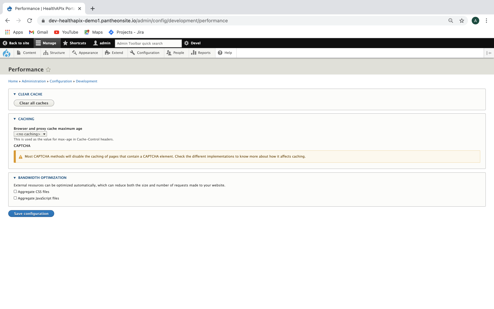
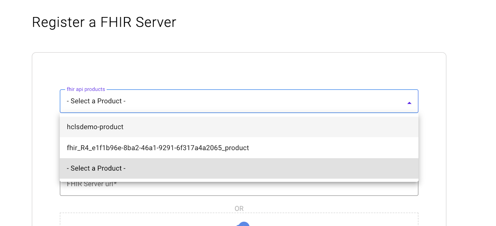
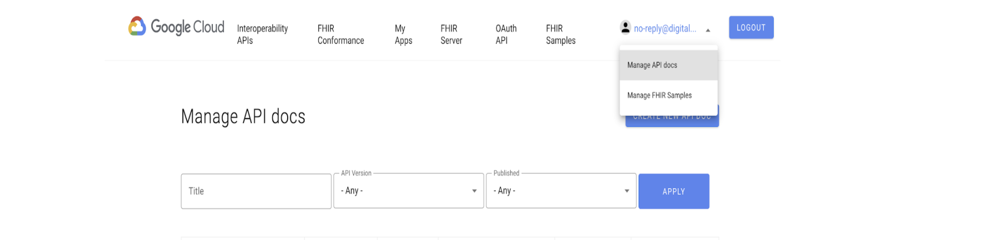
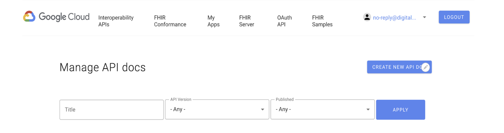
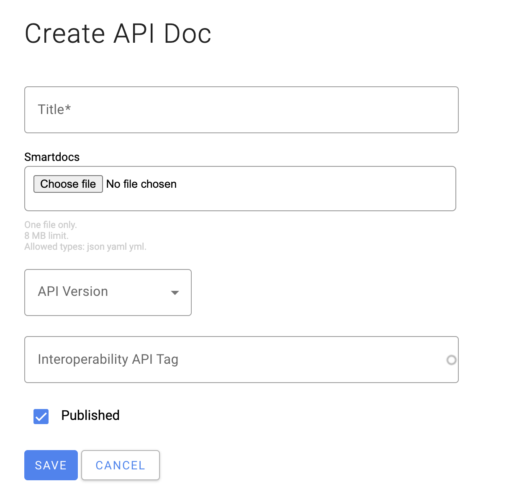
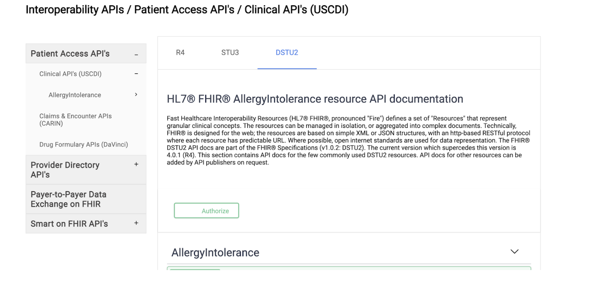
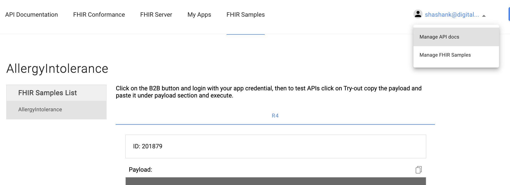
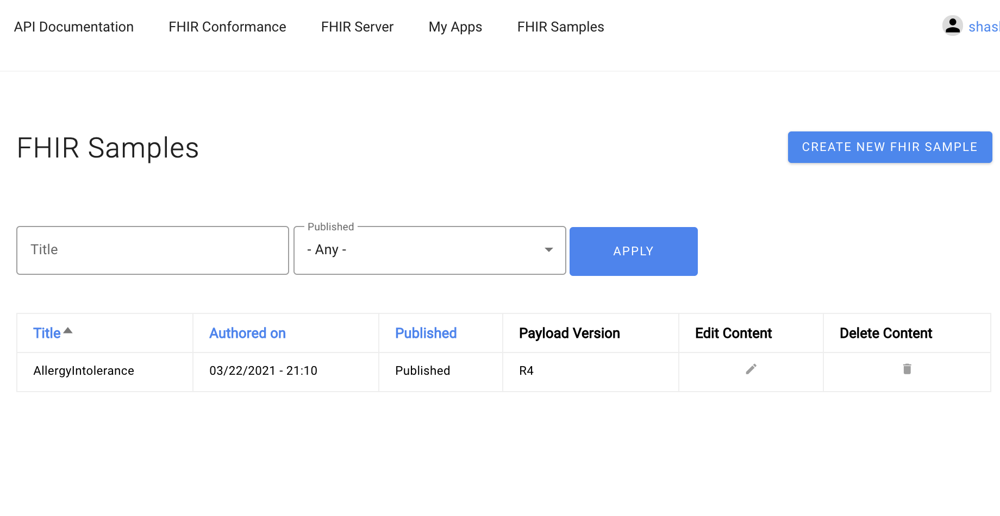

# HealthAPIx Developer Portal Configuration Guide for API Team Member

[A: FHIR Conformance Metadata](#A:-FHIR-Conformance-Metadata)  
[B: Create FHIR Server](#B:-Create-FHIR-Server)  
[C: Manage/Create API docs](#C:-Manage/Create-API-docs)  
[D: Manage/Create FHIR Sample](#D:-Manage/Create-FHIR-Sample)  

## A: FHIR Conformance Metadata

* Login as API Team Member into the Developer Portal

* Update FHIR Conformance Metadata URLs by navigating to the URL: `https://(ip address of the portal)/admin/config/conformance_api`

* Add the metadata URLs for the R4, STU3 and the DSTU2 server

* Click on Save Configuration to save the configuration.

* Navigate to the URL: `https://(ip address of the portal)/admin/config/development/performance` and click `Clear all caches` to clear all the caches in portal.

* Verify FHIR Conformance Page by navigating to the url: `https://(ip address of the portal)/conformance-report`



## B: Create FHIR Server

* Login as API Team User into the Developer Portal

* From Top menu select FHIR Server which takes you to 'Manage FHIR Server' page

* Click on '+ Add Server' button which takes you to 'Add FHIR Server' page

* Create New FHIR Server by filling up following required fields

>* Fhir server: `<FHIR-server-name>`
>* Fhir server url: `<Proxy url of the FHIR Server proxy>`
>* Fhir product: `<Select one product from dropdown for the above mentioned proxy>`
>* Fhir version: `<FHIR Version>`



## C: Manage/Create API docs

* Login into Developer Portal as API Team member

* Under user email, Click on 'Manage API docs' link



* In the Manage API Docs page, Click on the 'Create New API Doc' on the top right corner to create a new API Doc



* The Interoperability API tag field is an taxonomy term autocomplete field which is used to tag the content for the hierarchy in the API doc/swagger. The content which is tagged will be displayed under that respective  tag in the left side hierarchy block in the api doc page as shown below image(API Doc Page image).



* Add all the details and click on 'Save' for the content to be created

* This action also adds the link in the hierarchy block.



## D: Manage/Create FHIR Sample

* Login into Developer Portal as API Team member

* Under user email, Click on 'Manage FHIR Samples' link



* In the Manage FHIR Samples page, Click on the 'Create New FHIR Sample' on the top right corner to create a new FHIR Sample



* Create a sample by entering values

* Title -> AllergyIntolerance

* payload id -> 201879 (Any random number)

* payload version -> Select FHIR version depending on what version this sample belongs to. Select R4 this time

* payload -> Enable 'source' mode by clicking on 'source' button and add following formatted text. Include everything including and in between 'pre' tags. NOTE - The content or the text needs to be added in the 'source' mode as it has some html tag in it

```pre
{
    "resourceType": "AllergyIntolerance",
    "meta": {
        "versionId": "1",
        "lastUpdated": "2019-09-28T10:06:03.599+00:00"
    },
    "recordedDate": "2016-09-05T20:14:28-04:00",
    "patient": {
        "reference": "Patient/201240"
    },
    "substance": {
        "coding": [
            {
                "system": "http://snomed.info/sct",
                "code": "425525006",
                "display": "Allergy to dairy product"
            }
        ]
    },
    "status": "active",
    "criticality": "CRITH",
    "type": "allergy",
    "category": "food"
}
```

* Save the Changes
